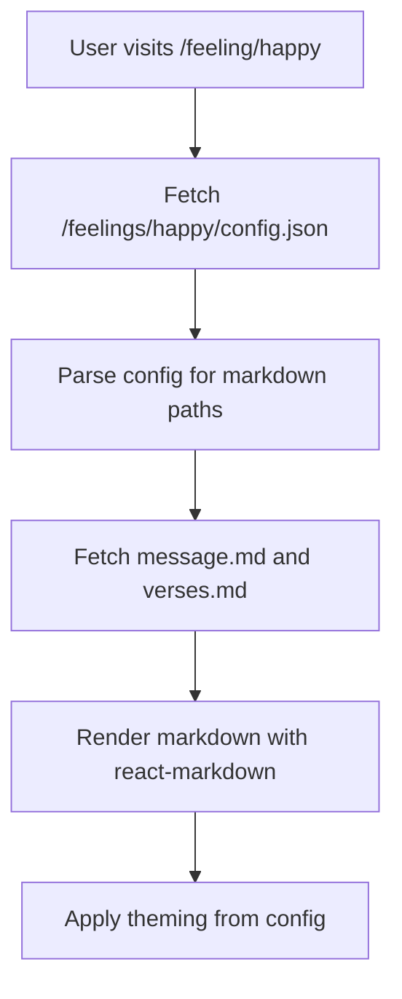

# Gift Website Plan (Updated)

## Tech Stack

- **React** with React Router for navigation
- **Vite** as build tool
- **Markdown files** for content with `react-markdown` for rendering
- **JSON configs** for structure and theming
- **GitHub Pages** for hosting

## Project Structure

```
/
├── src/
│   ├── components/          # Reusable components
│   │   ├── Card.jsx        # Card component for galleries
│   │   ├── Gallery.jsx     # Gallery grid layout
│   │   ├── Layout.jsx      # Common layout wrapper
│   │   └── MarkdownRenderer.jsx  # Markdown content renderer
│   ├── pages/              # Route pages
│   │   ├── Home.jsx        # / - Welcome message
│   │   ├── FeelingGallery.jsx    # /feeling
│   │   ├── FeelingDetail.jsx     # /feeling/:emotion
│   │   ├── LetterGallery.jsx     # /letter (hidden from nav)
│   │   ├── LetterDetail.jsx      # /letter/:letter_title
│   │   ├── MemoryGallery.jsx     # /memory (hidden from nav)
│   │   └── MemoryDetail.jsx      # /memory/:memory_name
│   ├── App.jsx            # Main app with routing
│   └── main.jsx           # Entry point
├── public/
│   ├── feelings/           # Feelings content
│   │   ├── happy/
│   │   │   ├── config.json
│   │   │   ├── message.md
│   │   │   └── verses.md
│   │   ├── sad/
│   │   │   ├── config.json
│   │   │   ├── message.md
│   │   │   └── verses.md
│   │   └── worried/
│   │       ├── config.json
│   │       ├── message.md
│   │       └── verses.md
│   ├── letters/            # Letters content (hidden from nav)
│   │   └── [letter-folders]/
│   ├── memories/           # Memories content (hidden from nav)
│   │   └── [memory-folders]/
│   └── assets/             # Shared resources
│       ├── images/
│       ├── gifs/
│       └── videos/
├── index.html
├── package.json
└── vite.config.js
```

## Content Structure

### Feelings: `public/feelings/[emotion]/config.json`

```json
{
  "title": "Happy",
  "message": "message.md",
  "verses": "verses.md",
  "theming": {
    "backgroundColor": "#FFF9E6",
    "textColor": "#333333",
    "accentColor": "#FFD700"
  }
}
```

### Markdown Files Support

- Embedded images: ``
- GIFs: ``
- Videos: `<video src="../../assets/videos/video.mp4" controls />`
- Links: [`Watch this`](https://youtube.com/...)

### Letters & Memories Structure

Similar folder-based approach:

- `public/letters/[letter-title]/config.json` + markdown
- `public/memories/[memory-name]/config.json` + markdown

Routes will work but won't appear in navigation yet.

## Key Features

1. **Folder-based IDs**: Folder name = route parameter (e.g., `happy/` → `/feeling/happy`)
2. **Dynamic Content Loading**: Fetch config.json, then load referenced markdown files
3. **Rich Markdown Content**: Support for images, videos, GIFs, links
4. **Per-page Theming**: Each feeling can have custom colors
5. **Hidden Navigation**: Letters & memories routes exist but hidden from nav
6. **Responsive Design**: Mobile-first for NFC scanning

## Implementation Details

### Loading Content Flow



### Navigation Component

- Show: Home, Feelings Gallery
- Hide: Letters Gallery, Memories Gallery
- All routes remain accessible via direct URL

## GitHub Pages Deployment

1. Configure `vite.config.js` with base path
2. Markdown and config files in `public/` are copied as-is
3. Deploy: `npm run deploy` pushes to gh-pages branch

## NFC Card URLs

Direct links to feelings:

- `https://[username].github.io/[repo]/feeling/happy`
- `https://[username].github.io/[repo]/feeling/sad`
- etc.